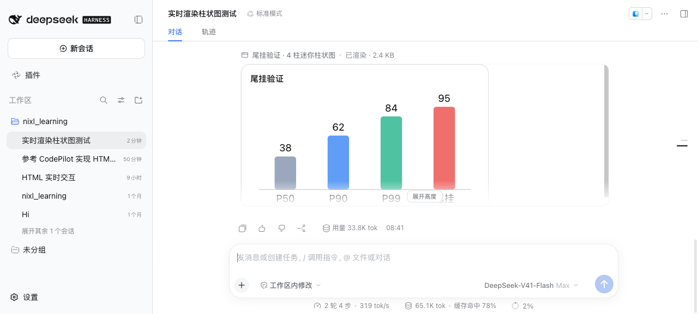

# dsh-html-live-preview · HTML 实时预览插件

在 [DeepSeek Harness](https://github.com/deepseek-ai/deepseek-harness) 会话里**边写边渲染 HTML**：
模型调用一个工具，HTML 就随生成过程直接画在对话里——不是代码块，也不是侧边栏。

[English](README.md) · [npm](https://www.npmjs.com/package/dsh-html-live-preview)



## 它能做什么

- **边写边画**：模型还在写参数时，预览就开始长出来（容错解析半截 JSON，不必等调用结束）。
- **写完能交互**：`<script>` 在参数写完后按文档顺序执行一次，按钮、动画、图表、canvas 都能跑。
- **不会被折叠掉**：回合结束后 DSH 会把工具行收进"过程"折叠区，所以本插件在**回合尾部**再渲染一份
  （该槽位不参与折叠）。同一时刻每个调用只有一个 iframe。
- **跟随主题**：帧内继承宿主的 `--dsw-*` / `--dsh-*` 变量，另加一组易读别名，亮/暗切换即时生效。
- **报错说人话**：帧内脚本异常、子资源加载失败会在卡片下方显示可关闭的提示条；记录被窗口截断、
  无法重建时也会明确说明，而不是给一张空白框。

## 环境要求

- DeepSeek Harness 的 **web** profile（`dsh web`），已在 `0.1.7-rc.2` 上验证。
- 插件把 `@deepseek-ai/dsh-tools` 声明为 peer：版本范围之外 DSH 会**拒绝加载并说明原因**，
  而不是等到第一次调用才炸。

## 安装

用装着 Web UI 的那个 profile 安装：

```sh
dsh plugin --profile web add dsh-html-live-preview
```

Web UI 的 **插件**页面里有同样的操作。安装会自动把 bundle 选中，下一轮组合即挂载（HMR 实时生效）。

从本仓库源码安装（改完代码即生效）：

```sh
dsh plugin --profile web add link:/绝对路径/dsh-html-live-preview
```

装完请**开一个新会话**：已存在的会话保持它启动时的工具目录，所以工具会出现在下一个会话里。

`render_html` 注册在 tools 注册表的全局层，profile 里每个 agent（含子 agent）都能调用，不需要改预设。

## 用法

随便怎么说，只要结果是"看得见的东西"：

> "画一个这周延迟的柱状图"
> "做个登录页的界面稿，按钮点一下要有反应"
> "演示快排是怎么分区的"

模型会调用 `render_html({ html, title?, height? })`。卡片悬停时出现四个控件：
**看 HTML 源码**、**复制**、**重跑脚本**、**展开高度**（默认上限 620px，免得一张预览吃掉整屏）。

## 工作机制

**宿主半边**（[index.js](index.js)）只做校验与记账：限制 256 KiB、返回几 token 的回执。
HTML 本体留在会话日志的 `tool/call` 参数里，所以重开会话/回放照样能渲染，既不额外占存储也不占上下文。

**浏览器半边**（[client.js](client.js)）是 DSH 客户端模块工厂形式的普通 classic script——
**不需要构建**，除平台内置的 `react` 外不 import 任何东西：

| 渲染位置 | 时机 | 原因 |
|---|---|---|
| `tool.call.toolview` | 回合进行中 | 从半截参数流式渲染 |
| `conversation.chat.turnTail` | 回合结束后 | 尾部不在折叠区内，预览得以常驻 |

帧本身的关键设计：

1. **常量 receiver 文档**：iframe 的 `srcdoc` 永远是一份固定外壳（CSP + 主题变量 + 测量脚本），
   模型写的 HTML 只通过 `postMessage` 注入，因此流式更新不会重载/闪烁。
2. **两阶段注入**：流式阶段剥掉 `<script>` 与 `on*`（`innerHTML` 插入的 `<script>` 不会执行，
   但 `` 会）；落地后注入完整 HTML 并按序执行一次脚本（外链脚本等 `load` 再继续）。
3. **沙箱**：`sandbox="allow-scripts"`，不含 `allow-same-origin`（opaque origin）。帧内 CSP 为
   `default-src 'none'`、`connect-src 'none'`（无 fetch/XHR/WebSocket）、
   `frame-src`/`object-src 'none'`、`base-uri`/`form-action 'none'`；
   放行内联脚本、4 个 CDN（jsdelivr / unpkg / cdnjs / esm.sh）与 `data:`/`https:` 图片字体。
   链接转发给宿主，校验协议后用外部浏览器打开。
4. **自动高度**：帧内 `ResizeObserver` 回传内容高度（60ms 去抖），卡片夹在内容与上限之间、
   按 callId 缓存（重挂载不会塌成 0）；超出上限的部分保留自己的滚动条，可展开到 2400px。

## 验证情况

**真实 GUI + 真实模型调用**（截图见 [screenshots/](screenshots)）：工具行渲染出卡片；
回合结束后预览常驻在回复下方；高度由帧内测量回传（490px / 260px）；控制台无报错、无 slot 崩溃。

**组件级回归夹具** [test/harness.html](test/harness.html)：用假 `window.__ModuleLoader__` + 真 React
直接渲染本插件组件，不需要 DSH、不消耗模型额度，覆盖流式解析、落地执行、清洗、高度上限、
展开、源码视图、主题切换、帧内报错：

```sh
mkdir -p /tmp/hp && cd /tmp/hp
cp /path/to/dsh-html-live-preview/client.js .
cp /path/to/dsh-html-live-preview/test/harness.html .
curl -sO https://unpkg.com/react@18.3.1/umd/react.development.js
curl -sO https://unpkg.com/react@18.3.1/umd/react-dom.development.js
open harness.html
```

## 已知限制

- **不支持 ```html 围栏自动渲染**：DSH 目前没有任何"自定义 fence 渲染"扩展点
  （`ui-primitives` 里的 `renderCode` 是硬编码的），只能走工具调用。这是上游插槽缺口。
- **DSH 升级**：声明范围是 `^0.1.7-rc.2`，范围之外 DSH 会停用本插件并给出原因，不会运行时崩；
  放宽范围是改一行 + 重新验证。
- **帧内不能联网**（设计如此）：需要数据的可视化要把数据内联，或用允许的 CDN 加载库。
- **会话窗口截断**：如果记录的调用落在已加载窗口之外，卡片会说明无法重建预览。
- **改插件自身代码需要重启**：DSH 只热重载 profile 清单与补丁，客户端 bundle 与宿主模块按进程缓存。

## 许可

[MIT](LICENSE)
